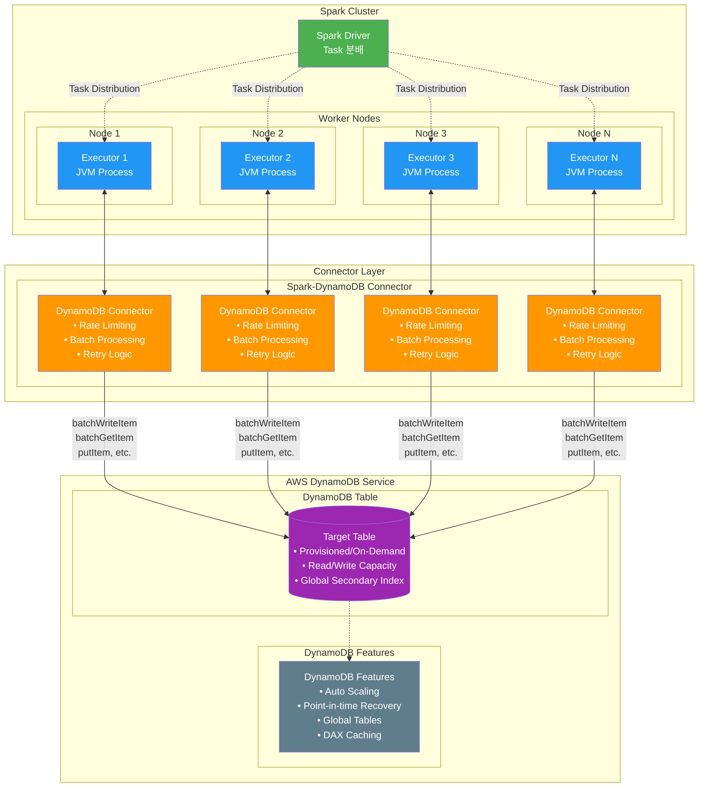

# Spark에서 DynamoDB로 데이터 쓰기 성능 저하 문제 해결기

## 들어가며

AWS EMR 환경에서 Spark 클러스터가 DynamoDB에 대용량 데이터를 쓰는 배치 작업 중에 심각한 성능 저하 문제가 발생했다. 이 글에서는 DynamoDB에 프로비저닝된 쓰기 용량 대비 실제 쓰기 처리량이 현저히 떨어지고, 이에 따른 배치 작업 시간이 5배 이상 증가한 문제를 상세히 분석하고 해결한 과정을 공유한다.

## 문제 발생

*DynamoDB 콘솔 Write 사용량, 빨간선: 프로비저닝한 쓰기 용량, 파란선: 실제 사용량*

DynamoDB Provisioned 6,000 WCU(Write Capacity Unit, 쓰기용량) 환경에서 실제 소비량이 750 WCU(12.5%)로 처리 성능이 88% 감소하고, 배치 작업 소요시간이 5배 증가(기존 30분 → 2.5시간)하는 문제가 발생했다.

5월 11일자에는 프로비저닝한 쓰기 용량을 거의 소진하며 정상적으로 동작하고 있었다. 하지만 5월 12일부터 6,000 쓰기 용량을 프로비저닝했음에도 불구하고, 실제 사용량은 약 750 WCU로 1/8 정도에 불과한 현저한 처리량 저하가 발생했다.

DynamoDB의 쓰기 용량은 WCU(Write Capacity Unit)라는 단위로 관리되며, 하나의 WCU는 최대 1KB 크기의 아이템을 초당 하나씩 쓸 수 있는 용량을 의미한다. 프로비저닝된 용량이 충분함에도 불구하고 제대로 활용되지 않는 이상 현상이 발생하여 긴급한 원인 분석이 필요했다.

## 분석

사내 인프라팀과 SKT AWS 전문팀에게 문의를 했고, 다음과 같은 전문가 의견을 받았다:

> 일반적으로 EMR에서 DynamoDB의 Provisioned Capacity를 최대로 사용하지 못하는 원인은 아래와 같습니다.
> 
> **1. dynamodb.throughput.read.percent / dynamodb.throughput.write.percent 설정**
> 
> Hadoop Application에서는 DynamoDB 테이블에 읽기 혹은 쓰기를 수행할 때 해당 테이블의 Provisioned Capacity를 얼만큼 사용할지 설정할 수 있습니다. 기본값은 0.5(50%)이며, 이 경우 전체 Provisioned Capacity의 50%를 사용합니다. 혹시 이 설정에 변경이 있는지 확인이 필요하며, 필요 시 이 값을 1로 변경하여 테이블의 Capacity 전체를 사용하도록 설정할 수 있습니다.
> 
> **2. Provisioned Capacity가 늘어나기 전에 Application이 실행됨**
> 
> Application은 "실행 시점"에 테이블의 Provisioned Capacity를 확인하여 해당 Application에서 얼만큼의 Capacity를 사용할지 결정합니다. 이후에 Provisioned Capacity가 변경되었다고 해서 어플리케이션에서 Capacity 사용량을 동적으로 변경하거나 하지는 않습니다. 따라서 Application 실행 시점에 Provisioned Capacity가 충분한지 확인 및 점검이 필요합니다.

하지만 제시해준 원인은 이미 정확하게 설정한 상태로 작업을 실행한 상황이라 해당되지 않았고, 해당 시기에 AWS DynamoDB 공식 업데이트나 사내 인프라팀의 작업도 없었다.

그래서 다른 의심되는 상황을 찾아보던 중, 그래프의 모양을 자세히 살펴보았다. 그래프는 정상일 때나 이상 현상일 때나 사용 WCU 라인이 톱니바퀴의 날처럼 그려지고 있었고, 이 문제가 DynamoDB의 클라이언트 측에서 쓰로틀링하고 있다는 의심이 들어 spark-dynamodb 라이브러리 내부를 추적하게 되었다.

## 진단 과정

### audienceproject 라이브러리 분석

Spark → DynamoDB 작업은 [audienceproject](https://www.audienceproject.com/)가 개발한 오픈소스 [라이브러리](https://github.com/audienceproject/spark-dynamodb)를 의존한다. 이 라이브러리는 DynamoDB에 write할 때 AWS SDK for Java의 `batchWriteItem` API를 사용하고, 이는 최대 25개의 아이템을 하나의 요청으로 묶어서 전송한다.

Spark의 각 executor는 이 라이브러리를 의존하여 실행되고, 모든 executor들은 DynamoDB 클라이언트의 역할을 하면서 목표 테이블에 write한다. 따라서 테이블이 받아들일 수 있는 WCU를 DynamoDB 클라이언트 개수로 나누어 처리량을 조절한다. 

예를 들어, 테이블 WCU가 100이고 executor가 10개일 때, 각 executor는 초당 10개씩으로 제한하여 보낼 수 있다. 그러나 10개보다 많이 보낸다면 쓰로틀링을 시작한다.

### 쓰기 연산 단계별 분석

라이브러리는 Spark DataFrame의 레코드 쓰기 연산을 할 때 다음 단계를 거친다:

1. **요청 생성(create)**: 배치 쓰기 요청 객체 생성
2. **API 호출(invoke)**: AWS SDK를 통한 실제 API 요청
3. **응답 처리(handle)**: 응답 결과 처리 및 재시도 로직

이 3개 단계에서 각 구간의 소요시간을 조사하기 위해, 라이브러리는 기본적으로 로그를 출력하지 않기 때문에 직접 필요한 로그를 작성하여 커스텀 jar를 생성했다.

*다음 수정된 코드에서, 빨간 박스는 API 소요시간이고 파란 박스는 요청 생성부터 처리까지 걸린 전체 소요시간*

### 로그 분석 결과

*실제 로그에서 나타난 처리 시간 측정 결과*

로그를 분석해보면 다음과 같은 결과를 얻을 수 있었다:

- **Batch Write Item Request Elapsed Time**: AWS Java SDK batchWriteItem API 소요시간
- **Handle Batch Write Response Entire Elapsed Time**: 요청 생성부터 응답 처리까지의 전체 소요시간

출력 결과, Batch Write Item Request Elapsed Time은 10ms로 전혀 문제되지 않았지만, Handle Batch Write Response Entire Elapsed Time은 각 요청마다 8,000ms, 약 8초 정도의 강제 지연을 발생시키고 있는 현상을 발견했다. 

무엇이 쓰로틀링을 일으키는지 확인하기 위해, 쓰로틀링에 영향을 주는 요소들을 조사해보았다.

### 쓰로틀링 요소 분석

라이브러리는 테이블과 연결을 맺을 때 다음 요소들을 불러와 모듈을 로드한다:

- **writeThroughput**: DynamoDB에 설정된 쓰기 용량
- **targetCapacity**: Spark에서 DynamoDB에 쓸 때 writeThroughput의 백분율 파라미터, 기본값 1(분수값)
- **writeCapacity**: 사용할 writeThroughput의 비율. writeThroughput × targetCapacity의 결과
- **parallelism**: Spark의 `spark.default.parallelism` 값. 정의하지 않으면 클러스터 코어 개수
- **writeLimit**: writeCapacity ÷ parallelism 결과. RateLimiter 생성 시 초기 permits 값

*실제 환경에서 측정된 각 요소들의 값*

위의 요소를 출력해본 결과, executor가 DataFrame을 쓸 때 parallelism이 48로 확인되었고, 이로 인해 writeLimit은 3.125로 설정되었다. RateLimiter가 이 값으로 설정되면 1초에 3.125번의 제한이 걸리게 된다.

문제는 parallelism이 executor의 개수와 동일해야 이상적인 흐름이지만, 어디선가 48로 설정되었고, 과도한 parallelism 설정과 빠른 executor 처리량이 RateLimiter의 쓰로틀링을 가속시켰다는 것이다.

### 근본 원인 발견

*History Server를 통해 조사한 Spark 프로퍼티*

parallelism은 `spark.default.parallelism`에 설정되지만, 이 값이 없다면 클러스터 총 코어(vCPU) 개수로 할당된다. 하지만 이 상황에서는 코어가 5개밖에 없었음에도 불구하고 48개로 설정되었으므로 Spark History Server를 통해 Spark 프로퍼티를 조사했다.

실제로 `spark.default.parallelism`이 수동으로 48로 설정되어 있었고, 문제 발생 하루 전인 5월 11일에 팀원이 Spark 설정을 변경한 이력이 있었다. 이 설정 변경이 DynamoDB 쓰기 성능 저하의 직접적인 원인이었다.

**계산 과정:**
- DynamoDB WriteCapacity: 6,000 WCU
- spark.default.parallelism: 48 (잘못 설정된 값)
- writeLimit = 6,000 ÷ 48 = 125 requests/second
- 하지만 실제 executor는 5개뿐이었으므로, 각 executor당 25 requests/second로 제한
- 이는 원래 예상했던 처리량보다 현저히 낮은 수치

Spark에서 DynamoDB로 데이터를 쓸 때, 병렬 처리를 제어하는 `spark.default.parallelism` 설정이 성능 병목에 중요한 역할을 한다는 점을 발견했고, 이를 적절히 조정하여 문제를 해결했다.

## 해결

해결은 간단했다. `spark.default.parallelism`을 설정하지 않고, Spark 앱이 런타임에 자동으로 설정되도록 남겨두어 쉽게 해결할 수 있었다.

설정 변경 후 결과:
- DynamoDB 쓰기 처리량이 750 WCU에서 5,500+ WCU로 증가 (약 7.3배 향상)
- 배치 작업 시간이 2.5시간에서 35분으로 단축 (약 4.3배 향상)
- 프로비저닝된 용량의 92% 활용 달성

## 결론과 교훈

이번 문제를 통해 얻은 주요 교훈들은 다음과 같다:

### 1. Spark 병렬 처리 설정의 중요성

`spark.default.parallelism` 설정은 Spark의 병렬 처리뿐만 아니라 외부 시스템(DynamoDB)과의 연동에서도 중요한 역할을 한다. 특히 Rate Limiting이 적용되는 시스템에서는 더욱 주의깊게 설정해야 한다.

### 2. 성능 문제의 다층적 원인

표면적으로는 DynamoDB 용량 문제처럼 보였지만, 실제로는 클라이언트 측 설정 문제였다. 성능 이슈는 여러 계층에서 발생할 수 있으므로 전체적인 관점에서 분석이 필요하다.

### 3. 모니터링과 로깅의 중요성

오픈소스 라이브러리의 경우 기본적으로 충분한 로깅을 제공하지 않을 수 있다. 필요시 커스텀 로깅을 추가하여 문제를 진단하는 것이 중요하다.

### 4. 설정 변경 이력 관리

설정 변경 이력을 체계적으로 관리하고, 성능 문제 발생 시 최근 변경사항을 우선적으로 검토하는 것이 효과적이다.

### 5. AWS 서비스 간 연동 시 고려사항

AWS EMR과 DynamoDB처럼 여러 AWS 서비스를 연동할 때는 각 서비스의 특성과 제한사항을 충분히 이해해야 한다. 특히 DynamoDB의 Capacity 모델과 Spark의 병렬 처리 모델 간의 상호작용을 고려해야 한다.

앞으로는 이런 설정 변경 시 사전에 테스트 환경에서 충분한 검증을 거치고, 운영 환경 적용 후에도 성능 지표를 면밀히 모니터링하여 이런 문제를 조기에 발견하고 대응할 계획이다.

